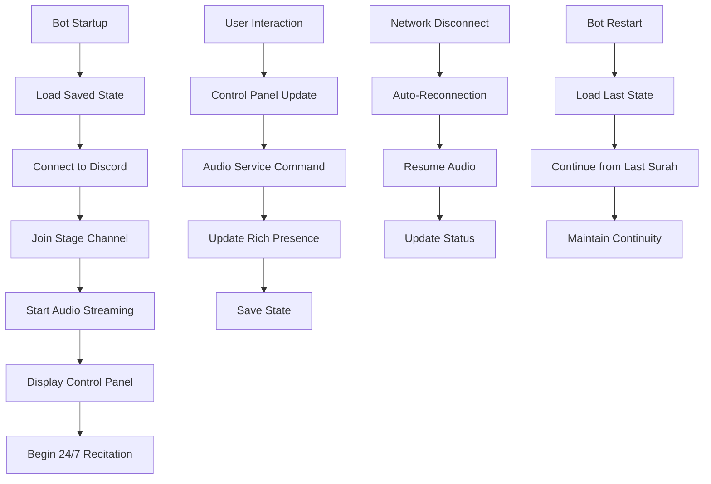
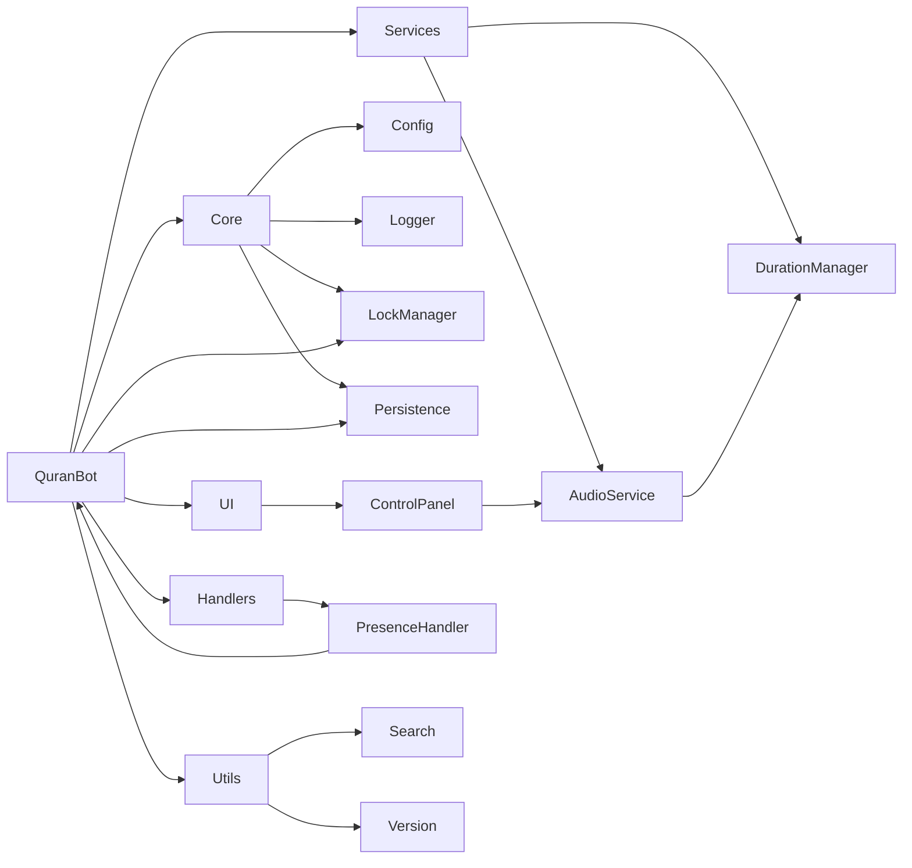

# 🕌 TahaBot - Professional 24/7 Quran Streaming Bot

<div align="center">

.gif)


**A sophisticated Discord bot designed for continuous 24/7 Quran recitation with advanced features**

*Built specifically for discord.gg/syria*

[](https://discord.gg/syria)

[Features](#-features) • [Installation](#-installation) • [Configuration](#-configuration) • [Usage](#-usage) • [Architecture](#-architecture)

</div>

---

## 🎯 Overview

**TahaBot** is a custom-built Discord bot that specializes in continuous 24/7 Quran recitation with professional audio streaming. Unlike traditional music bots, TahaBot never stops reciting and provides a seamless spiritual experience with advanced features for reliability and user engagement.

### ⚠️ **Important Notice**
This bot was custom-built for **discord.gg/syria** and is provided as-is for educational purposes. **No support will be provided** for setup, configuration, or troubleshooting.

### 🆕 **Features in v1.0.0**
- **🎵 MP3 Duration Management**: Accurate duration extraction and caching for precise progress tracking
- **💾 State Persistence**: Bot remembers current surah and reciter across restarts
- **🔒 Instance Locking**: Prevents multiple bot instances from running simultaneously
- **👥 User Interaction Tracking**: Shows last user actions in control panel
- **🎮 Rich Presence System**: Real-time Discord status updates showing current recitation
- **🔧 Stability Improvements**: Enhanced error handling and graceful shutdown procedures

---

## ✨ Features

### 🎵 **Professional Audio Streaming**
- **24/7 Continuous Playback**: Never stops reciting, maintains spiritual atmosphere
- **Multiple Reciter Support**: 6+ professional reciters with authentic Arabic names
- **Stage Channel Integration**: Full Discord stage channel support with automatic permissions
- **High-Quality Audio**: Professional MP3 files with accurate duration tracking
- **Seamless Transitions**: Smooth progression through all 114 Surahs

### 🎮 **Interactive Control Panel**
- **Surah Search**: Fuzzy search by Arabic or English names with intelligent matching
- **Direct Navigation**: Jump to any surah instantly with numbered selection
- **Reciter Switching**: Change reciter without interrupting the spiritual flow
- **Progress Tracking**: Visual progress bars with accurate time display
- **Playback Controls**: Play, pause, skip, and loop functionality
- **Real-Time Status**: Live updates of current surah and reciter

### 🧠 **Advanced State Management**
- **State Persistence**: Automatically saves current position every 30 seconds
- **Instance Locking**: PID-based locking prevents multiple bot instances
- **Intelligent Reconnection**: Exponential backoff for failed connections
- **Graceful Shutdown**: Clean resource cleanup with final state saving
- **Auto-Recovery**: Resumes from last position after unexpected restarts

### 🎮 **Dynamic Rich Presence** ⭐ *NEW!*
- **Real-Time Status**: Shows current surah and reciter in Discord status
- **Activity Updates**: Displays "Listening to: 📖 [Surah Name]" during recitation
- **Reciter Information**: Shows "Recited by [Reciter Name]" in status details
- **Automatic Updates**: Presence refreshes when surah changes
- **Live Feedback**: See current recitation directly in Discord status

### 📊 **Analytics & Logging**
- **Tree-Style Logging**: Professional structured logs with EST timezone
- **Daily Log Rotation**: Automatic log file management with cleanup
- **Performance Monitoring**: Tracks bot performance and connection status
- **User Interaction Logging**: Records all control panel interactions
- **Error Tracking**: Comprehensive error logging with context
- **Duration Analytics**: MP3 duration extraction and caching statistics

### 🎮 **Command System**
- **Interactive UI**: Modern Discord embed-based control panel
- **Access Control**: Stage channel members only can control playback
- **Permission System**: Automatic stage channel permission management
- **Real-Time Updates**: Live status updates in control panel
- **User Tracking**: Shows last user action and interaction history

---

## 🚀 Installation

### Prerequisites
- Python 3.13+ (Note: 3.13 recommended for latest features)
- Discord Bot Token
- Audio files (MP3 format) organized by reciter

### Quick Setup

1. **Clone the repository**
```bash
git clone https://github.com/trippixn963/TahaBot.git
cd TahaBot
```

2. **Create virtual environment**
```bash
python -m venv venv
source venv/bin/activate  # On Windows: venv\Scripts\activate
```

3. **Install dependencies**
```bash
pip install -r requirements.txt
```

4. **Configure environment**
```bash
cp .env.example .env
# Edit .env with your configuration
```

5. **Add audio files**
```bash
# Organize MP3 files by reciter in audio/ directory
audio/
├── Saad Al Ghamdi/
│   ├── 001.mp3
│   ├── 002.mp3
│   └── ... (114 files)
├── Abdul Basit Abdul Samad/
│   ├── 001.mp3
│   └── ... (114 files)
└── [Other Reciters]/
    └── ... (114 files each)
```

6. **Run the bot**
```bash
# Normal start
python main.py

# Force start (kill existing instances)
python main.py --kill
```

---

## ⚙️ Configuration

### Environment Variables

Create a `.env` file in the project root:

```env
# Discord Configuration
DISCORD_TOKEN=your_discord_bot_token

# Channel Configuration (Optional - auto-detected)
STAGE_CHANNEL_ID=channel_id_for_stage_channel

# Audio Configuration
AUDIO_DIRECTORY=audio
DEFAULT_RECITER=Saad Al Ghamdi
DEFAULT_SURAH=1

# Bot Behavior Settings
AUTO_SAVE_INTERVAL=30
LOG_LEVEL=INFO
TIMEZONE=EST
```

### Discord Bot Setup

1. **Create Discord Application**
   - Go to [Discord Developer Portal](https://discord.com/developers/applications)
   - Create new application
   - Go to "Bot" section and create bot
   - Copy the token to your `.env` file

2. **Set Bot Permissions**
   - Enable "Message Content Intent"
   - Enable "Server Members Intent"
   - Add bot to your server with appropriate permissions

3. **Configure Stage Channel**
   - Create stage channel for audio streaming
   - Ensure bot has stage channel permissions
   - Bot will automatically become stage speaker

---

## 🖼️ Visual Demo

<div align="center">

### Bot in Action
.gif)

*The TahaBot providing continuous spiritual recitation*

</div>

---

## 🎮 Usage

### Control Panel Features

| Feature | Description | Access |
|---------|-------------|--------|
| **Surah Search** | Find surahs by Arabic or English name | Stage Members |
| **Direct Selection** | Jump to any surah (1-114) | Stage Members |
| **Reciter Switch** | Change reciter without interruption | Stage Members |
| **Playback Controls** | Play, pause, skip functionality | Stage Members |
| **Progress Tracking** | Visual progress bars and time display | Everyone |
| **Loop Modes** | Off, single surah, or all surahs | Stage Members |

### Bot Behavior

**When Active:**
- Continuously streams Quran recitation 24/7
- Responds to control panel interactions
- Updates rich presence with current surah
- Saves state every 30 seconds
- Logs all user interactions

**When Inactive:**
- Stays connected but pauses audio
- Maintains stage channel presence
- Continues state persistence
- Preserves user interaction history

### Example Interactions

```
User: Searches for "Al-Fatiha" in control panel
Bot: Jumps to Surah 1 - Al-Fatiha and starts recitation

User: Changes reciter to "Abdul Basit Abdul Samad"
Bot: Seamlessly switches reciter while maintaining current surah

User: Uses skip button
Bot: Advances to next surah with smooth transition
```

---

## 🏗️ Architecture

### Project Structure

```
taha-discord-bot/
├── src/
│   ├── bot.py                 # Main bot class and event handlers
│   ├── core/
│   │   ├── config.py          # Configuration management
│   │   ├── logger.py          # Custom logging system
│   │   ├── lock_manager.py    # Instance locking system
│   │   └── persistence.py     # State persistence management
│   ├── services/
│   │   ├── audio/
│   │   │   └── audio_service.py # 24/7 audio streaming engine
│   │   └── duration_manager.py # MP3 duration extraction and caching
│   ├── handlers/
│   │   └── presence_handler.py # Dynamic rich presence updates
│   ├── ui/
│   │   └── control_panel.py   # Interactive Discord UI
│   ├── data/
│   │   └── surahs.py          # Surah name mappings
│   └── utils/
│       ├── search.py          # Fuzzy search functionality
│       └── version.py         # Version management system
├── audio/                     # Reciter audio files (MP3)
├── logs/                      # Daily log files
├── .env                       # Environment configuration
├── main.py                    # Application entry point
└── requirements.txt           # Python dependencies
```

### Core Components

**TahaBot Class**
- Main Discord client with event handlers
- Audio streaming coordination
- Control panel management
- Rich presence updates

**AudioService**
- 24/7 continuous audio streaming
- Multi-reciter support
- Auto-reconnection logic
- Progress tracking

**ControlPanel**
- Interactive Discord UI
- Surah search and navigation
- User interaction tracking
- Real-time status updates

**PersistenceManager**
- Automatic state saving
- Restart recovery
- JSON-based storage
- Background auto-save

**DurationManager**
- MP3 metadata extraction
- Duration caching system
- Performance optimization
- Accurate progress tracking

**LockManager**
- Instance locking prevention
- PID-based file locking
- Stale lock cleanup
- Force start support

### Bot Workflow Diagram



### System Architecture



---

## 🔧 Technical Details

### Dependencies

- **discord.py**: Discord API wrapper
- **ffmpeg-python**: Audio processing and streaming
- **psutil**: Process management for instance locking
- **python-dotenv**: Environment management
- **mutagen**: MP3 metadata extraction

### Performance Features

- **Async Operations**: Non-blocking audio and Discord operations
- **Connection Pooling**: Efficient Discord API connections
- **Error Handling**: Comprehensive error recovery and logging
- **Resource Management**: Proper cleanup and shutdown procedures
- **Caching System**: MP3 duration caching for performance

### Security Features

- **Permission Checks**: Stage channel member-only controls
- **Input Validation**: Safe message processing and validation
- **Rate Limiting**: Prevents API abuse and spam
- **Secure Configuration**: Environment-based secrets management
- **Instance Locking**: Prevents resource conflicts

---

## 📈 Monitoring & Analytics

### Logging System

- **Tree-Style Logging**: Structured logs with emoji indicators
- **Daily Rotation**: Automatic log file management
- **EST Timezone**: Consistent timezone handling with DST support
- **Error Tracking**: Comprehensive error logging with context
- **Performance Metrics**: Bot performance and connection monitoring

### Database Schema

```sql
-- Bot state persistence
CREATE TABLE bot_state (
    id INTEGER PRIMARY KEY,
    current_surah INTEGER,
    reciter TEXT,
    last_updated TIMESTAMP DEFAULT CURRENT_TIMESTAMP
);

-- User interaction tracking
CREATE TABLE user_interactions (
    id INTEGER PRIMARY KEY AUTOINCREMENT,
    user_id INTEGER,
    username TEXT,
    action TEXT,
    surah_number INTEGER,
    reciter TEXT,
    timestamp TIMESTAMP DEFAULT CURRENT_TIMESTAMP
);

-- Duration cache (JSON file)
{
    "Saad Al Ghamdi:1": 180.5,
    "Saad Al Ghamdi:2": 195.2,
    "Abdul Basit Abdul Samad:1": 185.1,
    ...
}
```

---

## ⚠️ Disclaimer

**This bot is provided for educational and spiritual purposes only.**

- **No Support**: This is a custom bot with no support provided
- **Use at Own Risk**: Not responsible for any consequences
- **Server-Specific**: Built for discord.gg/syria, may not work elsewhere
- **Spiritual Tool**: Designed to provide continuous Quran recitation

---

## 📄 License

This project is licensed under the MIT License - see the [LICENSE](LICENSE) file for details.

---

## 👨‍💻 Author

<div align="center">


**حَـــــنَّـــــا** - Custom Discord Bot Developer

*Built with ❤️ for discord.gg/syria*

</div>

---

<div align="center">

**⭐ Star this repository if you find it useful!**

[Report Bug](https://github.com/trippixn963/TahaBot/issues) • [Request Feature](https://github.com/trippixn963/TahaBot/issues) • [Discord Server](https://discord.gg/syria)

</div>